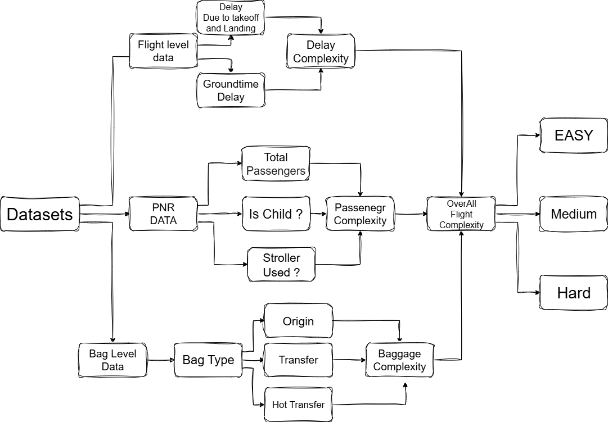

# ✈️ Flight Complexity Analysis and Prediction

A **data-driven framework** to evaluate and predict **flight complexity** using operational, passenger, and baggage factors — enabling smarter, delay-free airline operations.

---

## 📌 Problem Statement

Frontline teams at airlines work hard to ensure that every flight departs safely and on time.  
However, not all flights are equally easy to manage — some are more **complex** due to:
- Short ground turnaround time  
- Large number of passengers or baggage  
- Special service needs from customers  

Currently, complexity is **identified manually**, making it inconsistent and hard to scale.  
Hence, the goal is to build a **data-driven system** to automatically measure and predict how difficult each flight is to handle — called the **Flight Complexity Score**.

---

## 🎯 Objectives
- Compute a **Flight Complexity Score** for each flight using flight, passenger, and baggage data.  
- Identify the **main factors** that increase operational difficulty.  
- Help operations teams **plan and allocate resources** efficiently.  

---

## 📂 Data Description
- **Airports Data:** Minimum turnaround and airport-level details.  
- **Flight Level Data:** Schedules, delays, and ground time.  
- **PNR Level Data:** Passenger details — total passengers, children, stroller use.  
- **Bag Level Data:** Type of bags (Origin, Transfer, Hot Transfer).  
- **PNR Remarks Data:** Special service indicators.  

---

## 🧩 Solution Approach

### 1️⃣ Data Integration
Combined **flight**, **passenger**, and **baggage** datasets to form a unified view of each flight.

### 2️⃣ Feature Identification
Extracted parameters like:
- Ground time delay  
- Bag type ratios  
- Passenger load  

### 3️⃣ Scoring Framework
Weighted model for calculating overall flight complexity:
- Delay Complexity (45%)
- Passenger Complexity (35%)
- Baggage Complexity (20%)

### 4️⃣ Classification
Each flight is categorized into:
- **Easy**
- **Medium**
- **Hard**

---

## 🧮 Overall Framework

---

## 📊 Key Insights
- **Top 10 Hardest Routes:** Identified for resource prioritization.  
- **Company-wise Complexity:** Comparative performance analysis.  
- **Dominant Factor Analysis:** Which factor most impacts flight difficulty.  

---

## 💡 Recommendations
1. **Increase Buffer Time** — Adds resilience to small operational delays.  
2. **Handle Child Passengers Efficiently** — Reduces boarding delays.  
3. **Improve Baggage Handling** — Prioritize hot transfers and automate sorting.  

---

## 🚀 Advantages
- **Proactive Delay Management** — Predicts potential operational bottlenecks.  
- **Operational Efficiency** — Reduces turnaround time.  
- **Passenger Satisfaction** — Improved service and punctuality.  
- **Data-Driven Decisions** — Enables strategic planning.  
- **Scalability** — Model easily extended for more features (e.g., weather, crew data).  

---

## 🔮 Future Optimizations
- 🌦 **Weather Integration** — Real-time weather impact on delays.  
- 🛫 **Aircraft Model & Capacity** — Include aircraft-specific factors.  
- 👶 **Special Service Handling** — Improve prediction for assisted passengers.  
- ⚙️ **Emergency & Crew Scheduling** — Account for irregular operations.  
- 🧳 **Advanced Baggage Prioritization** — Optimize hot transfer logistics.  

---

## 🧰 Tech Stack
- **Python** (Pandas, NumPy, Scikit-learn, Matplotlib)  
- **Jupyter Notebook / Google Colab**  

---

## 📈 Impact
This model provides airlines a **quantitative measure of flight complexity**, helping them:
- Predict operational challenges  
- Optimize scheduling and staffing  
- Improve punctuality and passenger experience  

---

## 📜 License
This project is for educational and research purposes.

---

## 🙏 Acknowledgment
Developed for the **United Airlines Challenge - Skyhack 3.0** 

---
